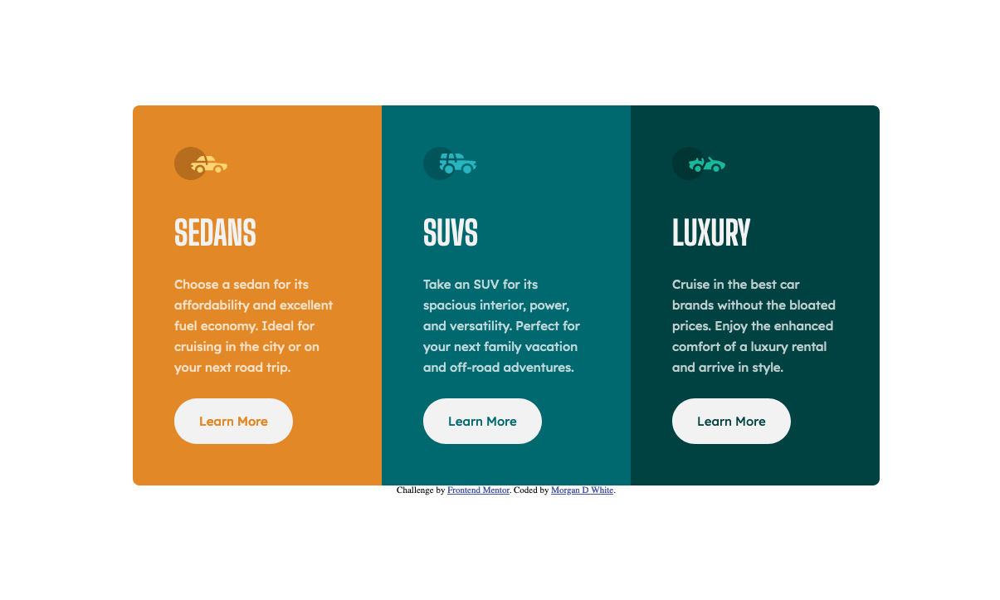
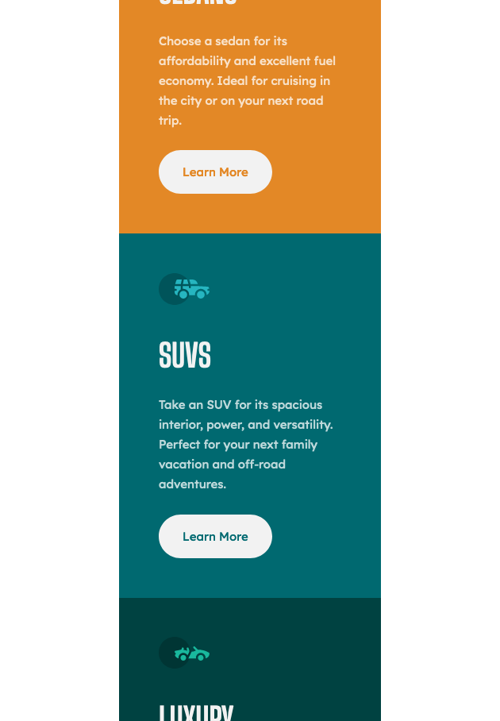

# Frontend Mentor - 3-column preview card component solution

This is a solution to the [3-column preview card component challenge on Frontend Mentor](https://www.frontendmentor.io/challenges/3column-preview-card-component-pH92eAR2-). Frontend Mentor challenges help you improve your coding skills by building realistic projects. 

## Table of contents

- [Frontend Mentor - 3-column preview card component solution](#frontend-mentor---3-column-preview-card-component-solution)
  - [Table of contents](#table-of-contents)
  - [Overview](#overview)
    - [The challenge](#the-challenge)
    - [Screenshot](#screenshot)
    - [Links](#links)
  - [My process](#my-process)
    - [Built with](#built-with)
    - [What I learned](#what-i-learned)
    - [Continued development](#continued-development)
  - [Author](#author)

**Note: Delete this note and update the table of contents based on what sections you keep.**

## Overview

### The challenge

Users should be able to:

- View the optimal layout depending on their device's screen size
- See hover states for interactive elements

### Screenshot

### Links

- Solution URL: [SOLUTION CODE](https://github.com/morganwhite/3-column-preview-card)
- Live Site URL: [LIVE](https://morganwhite.github.io/3-column-preview-card/)

## My process

### Built with

- Semantic HTML5 markup
- CSS custom properties
- Flexbox
- Mobile-first workflow

### What I learned

Mobile-first really is the way to go when building from scratch. It is easier to think about expanding something, rather than trying to squish a layout down after the fact.

### Continued development

Responsive componenets are still a challenge for me. I feel like there is a simple pattern for these parts of the site that I can return to over and over once I learn what it is. My biggest frustration is the transition from desktop to mobile layout. It could be smoother.

## Author

- Website - [Morgan White](https://www.morgandanielwhite.com)
- Frontend Mentor - [@momobgood](https://www.frontendmentor.io/profile/momobgood)
- Twitter - [@morgandwhite](https://www.twitter.com/morgandwhite)